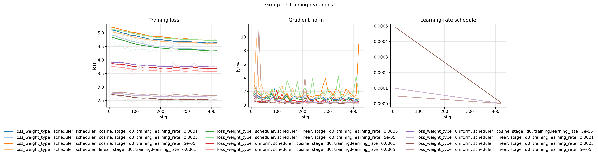
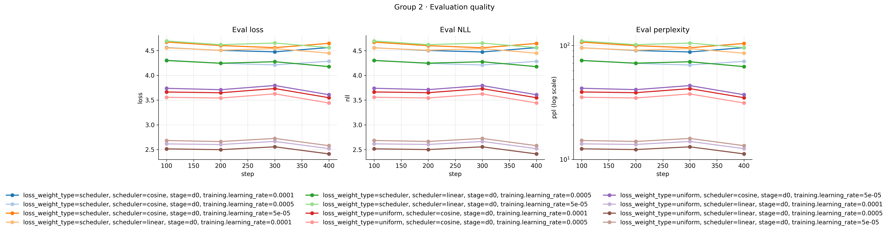

# Results-PILOT

## Experiment Configuration

### Hyperparameter Sweep d0
| Variable | Values swept | Number of values |
|:--|:--|--:|
| model.scheduler | linear, cosine | 2 |
| model.loss_weight_type | uniform, scheduler | 2 |
| training.learning_rate | 5e-5, 1e-4, 5e-4 | 3 |
| **Total configurations** |  | **12** |

### Fixed Parameters
| Section | Variable | Value |
|---|---|---:|
| dataset | num_test_samples | 2000 |
| dataset | num_workers | 4 |
| dataset | max_length | 1024 |
| training | num_epochs | 1 |
| training | batch_size | 64 |
| training | learning_rate | 5.0e-5 |
| training | weight_decay | 0.01 |
| training | warmup_ratio | 0.03 |
| training | grad_clip | 1.0 |
| training | logging_steps | 10 |
| eval | metric | "masked_lm_loss" |

---
## Figures

### Training Dynamics

### Evaluation Quality

## Table

| run                                                                                   |   final_train_loss |   best_eval_loss |   best_eval_ppl |   train_runtime_s |   train_samples_per_s |   total_flos |
|:--------------------------------------------------------------------------------------|-------------------:|-----------------:|----------------:|------------------:|----------------------:|-------------:|
| loss_weight_type=uniform, scheduler=linear, stage=d0, training.learning_rate=0.0005   |            2.53351 |          2.41268 |         11.1706 |           565.255 |                48.226 |  2.84219e+16 |
| loss_weight_type=uniform, scheduler=linear, stage=d0, training.learning_rate=0.0001   |            2.6384  |          2.51899 |         12.4236 |           569.256 |                47.887 |  2.84219e+16 |
| loss_weight_type=uniform, scheduler=linear, stage=d0, training.learning_rate=5e-05    |            2.69985 |          2.57882 |         13.1892 |           559.104 |                48.757 |  2.84219e+16 |
| loss_weight_type=uniform, scheduler=cosine, stage=d0, training.learning_rate=0.0005   |            3.58136 |          3.4413  |         31.2444 |           568.59  |                47.943 |  2.84219e+16 |
| loss_weight_type=uniform, scheduler=cosine, stage=d0, training.learning_rate=0.0001   |            3.69254 |          3.54767 |         34.7497 |           567.079 |                48.071 |  2.84219e+16 |
| loss_weight_type=uniform, scheduler=cosine, stage=d0, training.learning_rate=5e-05    |            3.75929 |          3.60838 |         36.9239 |           560.659 |                48.621 |  2.84219e+16 |
| loss_weight_type=scheduler, scheduler=linear, stage=d0, training.learning_rate=0.0005 |            4.37824 |          4.17582 |         65.1472 |           567.644 |                48.023 |  2.84219e+16 |
| loss_weight_type=scheduler, scheduler=cosine, stage=d0, training.learning_rate=0.0005 |            4.41884 |          4.21092 |         67.3409 |           562.754 |                48.44  |  2.84219e+16 |
| loss_weight_type=scheduler, scheduler=linear, stage=d0, training.learning_rate=0.0001 |            4.64316 |          4.44741 |         85.4832 |           569.106 |                47.9   |  2.84219e+16 |
| loss_weight_type=scheduler, scheduler=cosine, stage=d0, training.learning_rate=0.0001 |            4.67692 |          4.47389 |         87.6051 |           573.451 |                47.537 |  2.84219e+16 |
| loss_weight_type=scheduler, scheduler=cosine, stage=d0, training.learning_rate=5e-05  |            4.77943 |          4.55895 |         95.3824 |           572.122 |                47.647 |  2.84219e+16 |
| loss_weight_type=scheduler, scheduler=linear, stage=d0, training.learning_rate=5e-05  |            4.76691 |          4.55991 |         95.6666 |           564.852 |                48.26  |  2.84219e+16 |